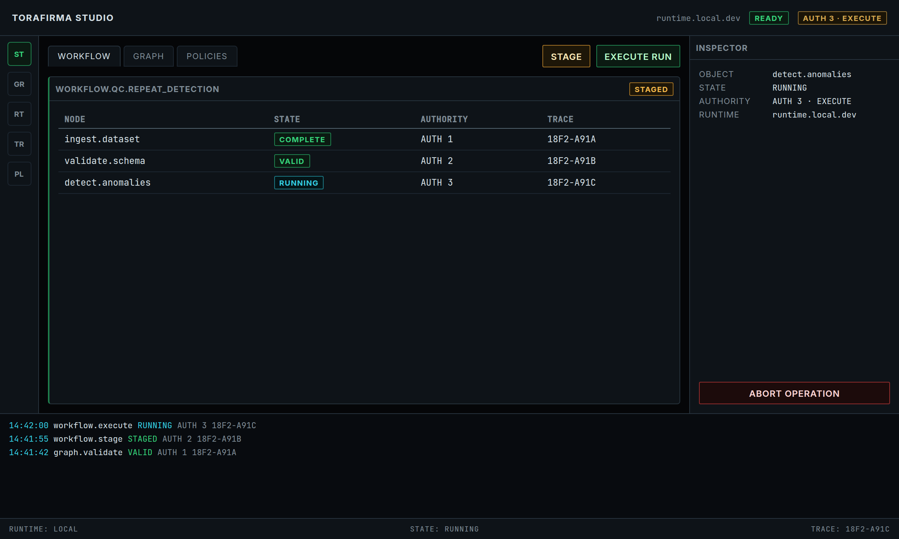
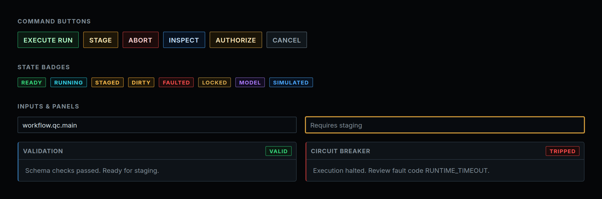
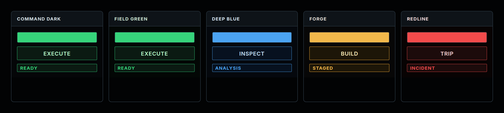

# Torafirma Design System v2

A React + TypeScript design system for **dark, dense, operator-facing interfaces** — the kind used to run workflows, inspect runtime state, gate actions by authority, and audit what the system did.

Install once, wire up CSS + Tailwind, and import components, hooks, and utilities from a single package.

```bash
npm install @torakagemusha-sudo/tf-design-v2 react react-dom tailwindcss
```

**npm:** [@torakagemusha-sudo/tf-design-v2](https://www.npmjs.com/package/@torakagemusha-sudo/tf-design-v2)

---

## What it looks like

The default **Command Cockpit** layout — command bar, workspace, inspector, and trace console:



**Buttons, badges, inputs, and panels** with semantic variants (run, stage, abort, fault, etc.):



**Five built-in themes** for different operational contexts:



---

## What this system is

Torafirma is not a generic SaaS UI kit. It is built around six ideas that show up in every component:

| Model | What it means in the UI |
|-------|-------------------------|
| **State** | Every surface shows whether something is idle, staged, running, faulted, locked, etc. |
| **Authority** | Consequential actions declare required permission levels (`AUTH_0` … `AUTH_6`). |
| **Commands** | Buttons are commands with an operation, target, and consequence — not anonymous clicks. |
| **Trace** | Important actions produce inspectable log lines with trace IDs. |
| **Governance** | Blocked, degraded, or uncertain states visually restrict what you can do. |
| **Density** | Information-rich layouts with hard edges, panels, and monospace telemetry. |

### How the package is organized

```
Tokens (CSS variables)
  ↓
Styles + Themes (5 palettes)
  ↓
Components (12 families — command, status, layout, data, graph, …)
  ↓
Layouts (Command Cockpit, Studio Builder, Trace Console, …)
  ↓
Hooks + Utils + State machines + Rules
```

**In practice:** import CSS tokens and a theme class, add the Tailwind preset, then use React components and hooks. The full specification covers 1,000+ component definitions; this package exports the implemented catalog from `@torakagemusha-sudo/tf-design-v2` (or subpath imports like `/components`, `/hooks`).

---

## Quick start

### 1. Import styles

```tsx
import '@torakagemusha-sudo/tf-design-v2/styles/tokens.css';
import '@torakagemusha-sudo/tf-design-v2/styles/themes.css';
import '@torakagemusha-sudo/tf-design-v2/styles/components.css';
import '@torakagemusha-sudo/tf-design-v2/styles/utilities.css';
```

### 2. Configure Tailwind

```js
// tailwind.config.js
import tfConfig from '@torakagemusha-sudo/tf-design-v2/tailwind';

export default {
  presets: [tfConfig],
  content: ['./src/**/*.{js,ts,jsx,tsx}'],
};
```

### 3. Wrap your app in a theme

```tsx
<div className="theme-command-dark">
  <App />
</div>
```

| Theme class | Best for |
|-------------|----------|
| `theme-command-dark` | Default operations UI |
| `theme-field-green` | Tactical / field ops |
| `theme-deep-blue` | Analysis / intelligence |
| `theme-forge` | Engineering / IDE |
| `theme-redline` | Incidents / threat response |

### 4. Use components

```tsx
import { CommandButton } from '@torakagemusha-sudo/tf-design-v2';

<CommandButton
  command={{
    id: 'run-workflow',
    label: 'Run workflow',
    operation: 'workflow.run',
    commandClass: 'execute',
    state: 'available',
    requiredAuthority: 'AUTH_3_EXECUTE',
  }}
  variant="run"
  onCommand={(cmd) => dispatch(cmd)}
/>
```

### 5. Use hooks

```tsx
import {
  useAuthority,
  useComponentState,
  useTheme,
  useCommand,
} from '@torakagemusha-sudo/tf-design-v2';

const { hasRequiredAuthority } = useAuthority('AUTH_3_EXECUTE');
const { state, transition } = useComponentState();
const { theme, setTheme } = useTheme();
const { execute, isExecuting } = useCommand(dispatch);
```

---

## What's in the box

| Area | Description |
|------|-------------|
| **12 component families** | Command, status, input, navigation, data, overlay, authority, AI, stream, safety, trace, workspace |
| **5 themes** | Command Dark, Field Green, Deep Blue, Forge, Redline |
| **20 layout templates** | Command Cockpit, Builder Studio, Trace Console, Emergency, and more |
| **18 state machines** | Workflow execution, staging, authority escalation, circuit breaker, … |
| **9 React hooks** | Authority, component state, theme, trace, command, validation, telemetry, modal, toast, drawer |
| **18 utilities** | Trace IDs, timestamps, state colors, `classNames`, debounce, deep merge, … |
| **Design rules** | Automated checks for naming, accessibility, token usage, authority disclosure |

### Main export paths

| Import | Use for |
|--------|---------|
| `@torakagemusha-sudo/tf-design-v2` | Everything (default) |
| `@torakagemusha-sudo/tf-design-v2/components` | React components only |
| `@torakagemusha-sudo/tf-design-v2/hooks` | React hooks |
| `@torakagemusha-sudo/tf-design-v2/utils` | Helper functions |
| `@torakagemusha-sudo/tf-design-v2/layouts` | Layout templates |
| `@torakagemusha-sudo/tf-design-v2/state-machines` | State machine configs |
| `@torakagemusha-sudo/tf-design-v2/tailwind` | Tailwind preset |

Styles ship from `src/styles/` (not compiled). TypeScript compiles to `dist/` on build.

```bash
npm run build   # compile before pack/publish (prepack runs this automatically)
```

---

## Documentation

Detailed guides live in [`docs/`](docs/):

| Doc | Topic |
|-----|-------|
| [Introduction](docs/01-INTRODUCTION.md) | Philosophy and voice |
| [Architecture](docs/02-ARCHITECTURE.md) | Layers, authority, trace pipeline |
| [Design tokens](docs/03-DESIGN-TOKENS.md) | Colors, spacing, motion |
| [Component catalog](docs/04-COMPONENT-CATALOG.md) | All 12 families |
| [State machines](docs/05-STATE-MACHINES.md) | Lifecycle models |
| [Layout templates](docs/06-LAYOUT-TEMPLATES.md) | Shell arrangements |
| [Themes](docs/07-THEMES.md) | Theme variables |
| [API reference](docs/12-API-REFERENCE.md) | Types and exports |

To regenerate README screenshots locally:

```bash
node docs/screenshots/capture.mjs
```

---

## Contributing

Implementation follows the Torafirma Specification Codex (product architecture, command grammar, component system, design tokens).

## License

MIT
